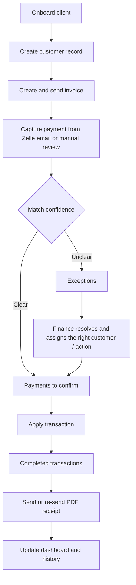

# Setu Billing Phase 1

Local full-stack prototype for:

- onboarding clients before billing starts
- sending invoice emails and PDF receipt emails through SMTP
- polling a Gmail inbox for Zelle-like confirmation emails
- matching parsed payments into `Payments to confirm` or `Exceptions`
- preserving resolved exception history with action, actor, and timestamp
- giving finance a spreadsheet-style customer register with a full 360 customer view
- summarizing saved received amounts on the dashboard by day, week, month, or year
- persisting the operational backend in PostgreSQL instead of a file store

## Simple Process Flow

Plain-English version:

- onboard the client
- send the invoice
- capture the payment
- review it in `Payments to confirm` or `Exceptions`
- apply it
- send the receipt
- keep the full history

## Run locally

1. Install dependencies:
   `npm install`
2. Start local Postgres:
   `npm run db:start`
3. Seed and migrate the database:
   `npm run db:seed`
4. Start the app:
   `npm run dev`
5. Open:
   `http://127.0.0.1:4173/`

## Portal login

The portal requires a local username and password before finance data loads.

Default local credentials:

- username: `admin`
- password: `setu-local-demo`

Change them in [.env](/Users/lohithdeshpande/Documents/Claude/Projects/FinanceProduct/.env) with:

- `PORTAL_USERNAME`
- `PORTAL_PASSWORD`
- `AUTH_SESSION_SECRET`

## Postgres backend

The backend now uses PostgreSQL as the system of record.

Useful commands:

- `npm run db:start` starts the local Postgres container
- `npm run db:stop` stops it
- `npm run db:logs` tails database logs
- `npm run db:migrate` runs schema migrations
- `npm run db:seed` migrates and seeds the database if it is empty
- `npm run db:reset` reseeds from the local source snapshot

Default local database:

- host: `127.0.0.1`
- port: `54322`
- database: `setu_portal`
- user: `setu`

The database connection is configured through [.env](/Users/lohithdeshpande/Documents/Claude/Projects/FinanceProduct/.env). The current seed source is:

- `server/storage/app-state.json`

That file is now a bootstrap source, not the live runtime store.

## Architecture

The current backend is designed as a small but scalable product foundation:

- React/Vite frontend talks to the Express API through `/api`
- Express routes stay thin and delegate persistence to the Postgres-backed store in [server/stateStore.js](/Users/lohithdeshpande/Documents/Claude/Projects/FinanceProduct/server/stateStore.js)
- Database setup is handled by:
  - [server/db/pool.js](/Users/lohithdeshpande/Documents/Claude/Projects/FinanceProduct/server/db/pool.js)
  - [server/db/migrations.js](/Users/lohithdeshpande/Documents/Claude/Projects/FinanceProduct/server/db/migrations.js)
  - [server/db/seed.js](/Users/lohithdeshpande/Documents/Claude/Projects/FinanceProduct/server/db/seed.js)
- Core schema is normalized across customers, contacts, aliases, invoices, payments, exceptions, activity, sequences, integrations, and dashboard projections in [server/db/migrations/001_portal_core.sql](/Users/lohithdeshpande/Documents/Claude/Projects/FinanceProduct/server/db/migrations/001_portal_core.sql)
- onboarding and billing preferences are stored alongside customer identity through [server/db/migrations/002_customer_profiles.sql](/Users/lohithdeshpande/Documents/Claude/Projects/FinanceProduct/server/db/migrations/002_customer_profiles.sql)

Performance and cost choices:

- normalized transactional tables instead of a single JSON blob
- indexed lookup columns for name, email, phone-last4, invoice status, payment queue status, and exception status
- connection pooling with configurable limits
- JSONB reserved only for low-volume integration state
- derived read model assembly for the current portal while keeping the write model ready for more APIs later

Suite-readiness notes:

- the schema is ready to expand into additional modules beyond billing
- the next natural product-suite step is adding `organizations` / `workspaces` and scoping each core table by tenant
- if email and sync volume grow, the next backend improvement should be an outbox/jobs layer so mail and inbox processing move off request threads

More detail is in [docs/architecture.md](/Users/lohithdeshpande/Documents/Claude/Projects/FinanceProduct/docs/architecture.md).

## Product artifacts

The repo includes the current-state product artifacts alongside the live code:

- updated wireframe: [files/phase1_prototype.html](/Users/lohithdeshpande/Documents/Claude/Projects/FinanceProduct/files/phase1_prototype.html)
- business requirements handoff: [files/setu_phase1_requirements.html](/Users/lohithdeshpande/Documents/Claude/Projects/FinanceProduct/files/setu_phase1_requirements.html)
- business pitch deck notes: [docs/pitch-deck.md](/Users/lohithdeshpande/Documents/Claude/Projects/FinanceProduct/docs/pitch-deck.md)
- business pitch deck slides: [files/setu_finance_pitch_deck.html](/Users/lohithdeshpande/Documents/Claude/Projects/FinanceProduct/files/setu_finance_pitch_deck.html)
- PowerPoint deck: [files/setu_finance_pitch_deck.pptx](/Users/lohithdeshpande/Documents/Claude/Projects/FinanceProduct/files/setu_finance_pitch_deck.pptx)
- pitch deck builder: [scripts/build-setu-pitch-deck.mjs](/Users/lohithdeshpande/Documents/Claude/Projects/FinanceProduct/scripts/build-setu-pitch-deck.mjs) for Codex presentation-runtime rebuilds
- simple process flow: [docs/process-flow.md](/Users/lohithdeshpande/Documents/Claude/Projects/FinanceProduct/docs/process-flow.md)
- detailed feature list: [docs/feature-list.md](/Users/lohithdeshpande/Documents/Claude/Projects/FinanceProduct/docs/feature-list.md)
- non-technical requirements: [docs/non-technical-requirements.md](/Users/lohithdeshpande/Documents/Claude/Projects/FinanceProduct/docs/non-technical-requirements.md)
- low-cost AWS solution architecture: [docs/aws-solution-architecture.md](/Users/lohithdeshpande/Documents/Claude/Projects/FinanceProduct/docs/aws-solution-architecture.md)
- design system notes: [docs/design-system.md](/Users/lohithdeshpande/Documents/Claude/Projects/FinanceProduct/docs/design-system.md)
- architecture notes: [docs/architecture.md](/Users/lohithdeshpande/Documents/Claude/Projects/FinanceProduct/docs/architecture.md)
- prompt and scope history: [docs/prompts-and-requirements.md](/Users/lohithdeshpande/Documents/Claude/Projects/FinanceProduct/docs/prompts-and-requirements.md)

## Configure real outbound email

Edit [.env](/Users/lohithdeshpande/Documents/Claude/Projects/FinanceProduct/.env) and fill either:

- `SMTP_URL`
- or `SMTP_HOST`, `SMTP_PORT`, `SMTP_SECURE`, `SMTP_USER`, `SMTP_PASS`, `SMTP_FROM`

If you use Gmail for outbound sending, `SMTP_PASS` must be a Gmail `App Password`, not the normal Gmail sign-in password.

Also set:

- `ZELLE_PAY_TO`
- `CARD_PAYMENT_BASE_URL` if you want a card link included in invoice emails

If the same email account is used for:

- sending invoices and receipts
- receiving Zelle confirmation emails
- receiving Zelle payments

then you can keep them aligned like this:

- `SMTP_USER=your_email@gmail.com`
- `SMTP_FROM="Setu Billing <your_email@gmail.com>"`
- `ZELLE_PAY_TO=your_email@gmail.com`

If `ZELLE_PAY_TO` is left blank, invoice emails now fall back to `SMTP_USER`, then the email inside `SMTP_FROM`.

Once SMTP is configured, the billing console chip changes from `Email not configured` to `Email ready`.

Current receipt flow:

- apply the transaction first
- then send or re-send the receipt separately from `Completed transactions`
- the receipt email includes a PDF attachment with the amount, transaction number, payment date, invoice reference if available, memo, and confirmation timestamp

Current exception-review flow:

- unresolved items stay in `Exceptions`
- manual customer assignment immediately attaches the transaction to that customer record and moves it into `Payments to confirm`
- resolved exceptions stay in history with the action taken, the resolving user, and the resolution timestamp

## Configure Gmail inbox sync

1. Create a Google OAuth desktop-app credential for the Gmail API.
2. Save the downloaded JSON file to:
   `server/credentials/gmail-oauth.json`
3. Authorize the local app once:
   `npm run gmail:authorize`
4. After the token is stored, use `Sync Zelle inbox` in the billing console.

If outbound email and inbox sync use the same Gmail account, sign in during the OAuth step with that same mailbox.

Current recommended Gmail filter:

- `GMAIL_QUERY='in:inbox subject:"You received money with Zelle"'`

This keeps the sync focused on the exact Zelle confirmation subject and ignores other inbox traffic.

The app stores Gmail authorization at:

- `server/credentials/gmail-token.json`

Sync behavior:

- the first sync uses `GMAIL_INITIAL_LOOKBACK_DAYS`
- later syncs run incrementally from the last successful sync time
- each incremental run rechecks a short overlap window using `GMAIL_SYNC_OVERLAP_MINUTES`
- already-seen Gmail message IDs are still deduplicated in the database, so overlap does not double-apply transactions

## Notes

- The inbox parser is heuristic-based and should be tuned with real Zelle confirmation samples from your bank inbox.
- If you want to reseed the database from the latest local snapshot, run:
  `npm run db:reset`
