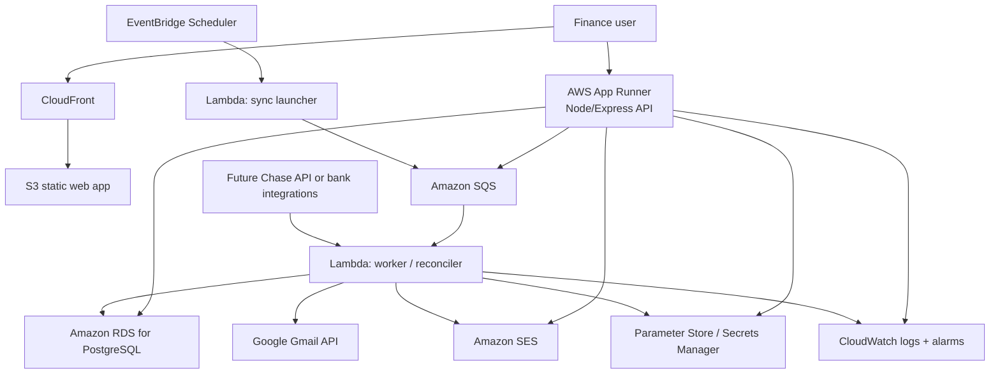

# Setu Finance AWS Solution Architecture

This document describes a low-cost AWS deployment target that preserves the current functionality while keeping a clean growth path into a broader product suite.

## Design Goals

- Keep monthly fixed costs low at early stage volume
- Preserve the current product behavior without forcing a rewrite
- Support secure email sending, Gmail/Zelle sync, and background transaction processing
- Keep the customer and finance data model ready for future product modules

## Recommended AWS Stack

| Layer | AWS service | Why it fits | Cost posture |
| --- | --- | --- | --- |
| Web app delivery | Amazon S3 + CloudFront + ACM + Route 53 | Static React app delivery with HTTPS and caching | Very low fixed cost |
| API runtime | AWS App Runner | Runs the existing Node/Express API with minimal ops overhead | Low-to-moderate fixed cost, avoids cluster management |
| Operational database | Amazon RDS for PostgreSQL | Managed Postgres with backups and strong compatibility with the current schema | Start single-AZ on `db.t4g.micro` |
| Async work | Amazon SQS | Decouples email send, Gmail sync, and reconciliation jobs | Pay mostly for usage |
| Scheduled sync | Amazon EventBridge Scheduler | Triggers mailbox sync jobs on a schedule | Very low cost |
| Background workers | AWS Lambda | Handles Gmail polling, queue processing, and light background jobs without a second always-on server | Pay per execution |
| Outbound email | Amazon SES | Lower-cost replacement for external SMTP providers | Usage-based and inexpensive |
| Secrets/config | AWS Systems Manager Parameter Store and AWS Secrets Manager | Keeps credentials and tokens out of code | Small fixed + usage cost |
| Monitoring | Amazon CloudWatch | Logs, alarms, and basic dashboards | Scales with usage |

## Proposed AWS Diagram

## Why This Is the Right Low-Cost Starting Shape

### Frontend

- The React app becomes a static build on S3.
- CloudFront provides HTTPS, caching, and a clean public URL.
- This avoids running a web server just to serve frontend files.

### Backend

- App Runner is the fastest path from the current local Express app to AWS.
- It keeps the codebase close to what already exists instead of forcing a serverless rewrite.
- It avoids the added operational weight of ECS cluster setup for the first production version.

### Database

- RDS PostgreSQL matches the existing schema and data access patterns.
- A small single-AZ instance is enough for early internal operations use.
- Storage can start small on `gp3` and grow only as data volume grows.

### Email and async processing

- SES handles invoice and receipt delivery more cheaply than most third-party email vendors.
- SQS and Lambda prevent slow email sends or mailbox syncs from blocking user-facing requests.
- EventBridge lets the Zelle sync run on a schedule instead of requiring a user to remember it.

## Functionality Preserved in AWS

- Login-protected internal portal
- Client onboarding with service history and customer IDs
- Invoice creation and sending
- Payment queues and exception queues
- Gmail-based Zelle sync
- One-click transaction apply with receipt email
- Referral program admin controls and reward tracking
- Dashboard and audit history

## Cost Guardrails

- Use one AWS region only at first
- Start with one App Runner service
- Start RDS as single-AZ, not multi-AZ
- Use SES instead of a higher-cost email vendor
- Use SQS + Lambda for background jobs so idle time costs stay low
- Do not add Redis, Kubernetes, or a data warehouse until scale truly requires them

## Growth Path Into a Product Suite

1. Add tenant or organization scoping to the data model.
2. Split the API into finance, customer, and admin modules.
3. Introduce a dedicated worker service if queue volume grows beyond Lambda comfort.
4. Move from App Runner to ECS/Fargate when multiple long-running services are needed.
5. Add Cognito or another identity provider when the product expands beyond an internal admin portal.
6. Add read replicas, warehouse reporting, or search infrastructure only when real usage justifies them.

## Important Tradeoff

If absolute lowest possible spend is the only goal, API Gateway + Lambda could be cheaper at very low traffic. The reason this document recommends App Runner instead is that it preserves the current Express application shape, keeps delivery simpler, and reduces rewrite risk while still staying cost-conscious.
