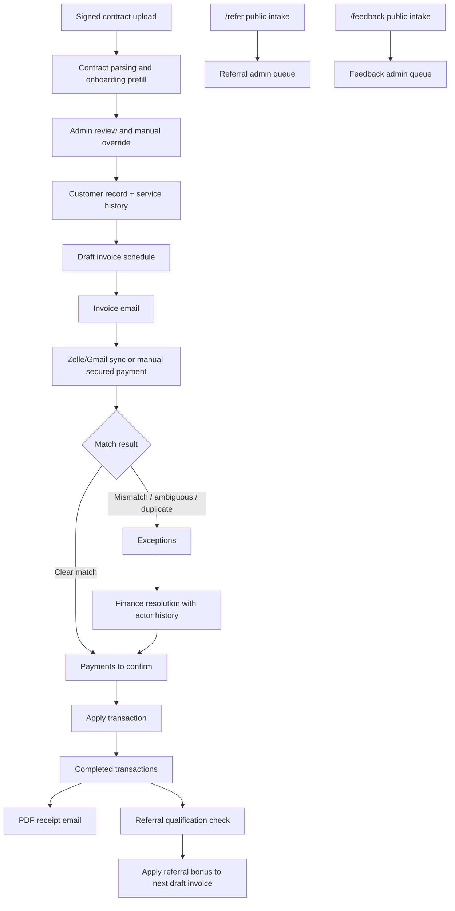

# Setu Finance Current State

Last updated: June 5, 2026

This document is the consolidated current-state handoff for the Setu Finance portal. It is written for business, finance, operations, and technical reviewers who need to understand what the portal does today.

## 1. Live Access

| Environment | URL | Purpose |
| --- | --- | --- |
| Local development | `http://127.0.0.1:4173/` | Local developer/operator testing. |
| AWS dev primary | `https://3.135.234.59.sslip.io/` | Current externally reachable dev portal. |
| AWS dev recovery | `https://18.218.196.158.sslip.io/` | Recovery/backup dev endpoint. |
| Public referral form | `/refer` | No-login referral intake. |
| Public feedback form | `/feedback` | No-login feedback intake with optional attachments. |

Security note: real passwords, OAuth tokens, SMTP passwords, and customer-sensitive secrets are not stored in documentation. Portal credentials are configured through environment variables or cloud secret storage.

## 2. Product Purpose

Setu Finance is an internal finance operations portal for contract-first client onboarding, invoice generation, payment capture, human payment review, receipt generation, customer 360 visibility, referral reward management, and feedback intake.

The portal is intentionally designed as a product-suite foundation. Customer identity, contracts, services, invoices, payments, referrals, feedback, settings, and audit history are stored as durable records instead of temporary spreadsheet rows.

## 3. Primary Users

| User | What they do in the portal |
| --- | --- |
| Finance operator | Onboard clients, upload contracts, create invoices, sync/review payments, resolve exceptions, send receipts. |
| Finance admin | Manage referral rules, Gmail sync settings, feedback queue, and operational configuration. |
| Leadership/business user | Review collections, outstanding work, referral performance, exceptions, and operational risk. |
| Customer/member | Submit referrals through `/refer` and submit feedback through `/feedback` without logging in. |
| Future sales/employee referrer | Candidate for expanded referral portal; current implementation supports customer/public referral intake first. |

## 4. Current Functional Map

## 5. Portal Navigation

| Area | Current purpose |
| --- | --- |
| Dashboard | Default landing page with finance metrics, transaction trend, exception visibility, referral trend, and bonus spend. |
| Client onboarding | Contract-first intake, required customer fields, services, fee type, recurring/one-time details, and invoice schedule. |
| Billing console | Invoice sending, Zelle sync, payment review, exception resolution, manual payments, completed transactions, receipts. |
| Customer search | Excel-like searchable customer register with status. |
| Customer 360 | Full customer profile page with contact data, contracts, services, invoices, payments, exceptions, referrals, and history. |
| Referral Program | Referral rules, public referral submissions, relationship tracking, reward qualification, invoice-discount application, feedback queue. |
| Settings | Gmail auto-sync settings and referral-program configuration. |
| `/refer` | Public no-login referral submission form. |
| `/feedback` | Public no-login feedback submission form with optional attachments. |

## 6. Client Onboarding

Current onboarding starts with contracts.

- Upload one or more signed contracts.
- Parse contract files for services, fee, installments, billing cadence, service start date, and contact hints.
- Allow admins to manually override all extracted fields.
- Require first name, last name, primary email, primary phone, and at least one service.
- Capture optional home address, referral source, billing notes, and Zelle identity hints.
- Support one-time and recurring fees.
- Generate invoice schedule rows from contract terms when available.
- Store uploaded contract metadata and make contracts visible from customer 360.

## 7. Customer Records And 360 View

Customers use stable numeric 6-digit customer codes.

The customer search experience supports lookup by:

- customer ID
- first name
- last name
- email
- phone
- alias
- invoice reference

The customer 360 page shows:

- signup and onboarding details
- emails, phones, and address
- enrolled services and service history
- contracts and contract-derived critical fields
- invoice ledger
- payment ledger
- open and resolved exceptions
- referrals made and referral source
- rewards and invoice-discount history

## 8. Invoicing

The billing console supports:

- new invoice creation for existing customers
- customer search during invoice creation
- customer-specific service selection
- custom service fallback
- draft and sent invoice states
- numeric invoice numbers
- invoice email sending
- Zelle payment instructions
- card payment URL support when configured
- referral bonus discounts on invoices

Referral rewards reduce invoice amounts. The current customer referral model does not issue direct cash credits.

## 9. Payment Capture

Setu Finance supports two payment intake paths.

Gmail/Zelle sync:

- Reads Gmail through OAuth.
- Filters to relevant Zelle confirmation emails.
- Stores Gmail message IDs to avoid reprocessing.
- Uses incremental sync with overlap.
- Captures exact cents, transaction number, sent date, memo, sender name, message sender, message recipient, raw extracted text, and parsed payload.
- Supports admin-configurable auto-sync interval, currently designed for every 5 minutes.

Manual secured payment:

- Used only after funds are verified outside Gmail sync.
- Supports manually verified Zelle, bank transfer, check, cash, card processor, or other secured route.
- Captures amount, date, route, transaction/reference, memo, invoice link, and internal verification note.

## 10. Matching And Exceptions

The matching engine uses deterministic signals:

- customer names
- aliases
- emails
- phone hints
- invoice amounts
- transaction references
- invoice/customer context

Clear matches go to `Payments to confirm`. Unclear or risky payments go to `Exceptions`.

Exception handling supports:

- assign transaction to an existing customer
- save alias for future matching
- move valid matched transactions forward for finance apply
- accept valid non-duplicate linked transactions
- archive duplicates
- preserve exception history with action, actor, timestamp, resolved customer, and resolved payment

Same Zelle transaction-number reuse is blocked and treated as possible replay/abuse risk.

## 11. Payment Application And Receipts

Payment application is human-controlled.

- Finance reviews and applies a payment.
- Applying updates the payment, invoice, customer 360, dashboard, activity, and referral qualification state.
- Sending a receipt is a separate action.
- Completed transactions include receipt status.
- Receipts can be sent or re-sent.
- Receipt email includes a PDF attachment.

Receipt PDF includes:

- customer name
- customer ID
- amount received
- payment date
- transaction/reference number
- memo
- invoice reference when available
- receipt issued timestamp

## 12. Referral Program

Current state is finance-admin centric with public customer referral intake.

Supported today:

- public no-login `/refer` form
- duplicate prevention by referred email or phone for active submissions
- admin referral queue
- referral relationship tracking
- relationship label and referral date
- configurable referral program name, description, bonus amount, qualification paid amount, and qualification months
- historical rule snapshot per referral
- qualification after payment or time threshold
- green qualified reward queue
- one-click `Apply referral bonus`
- invoice discount application instead of direct credit
- reporting for tracked referrals, qualified referrals, and bonus spend

Current limitation:

- Dedicated employee/sales/partner referral payout portal is not yet implemented.
- Employee/sales commissions and partner payouts should be modeled as a future `Referral Growth Portal` while Setu Finance remains the financial source of truth.

## 13. Feedback Intake

Setu Finance now includes a simple public feedback intake.

Users can open `/feedback` without logging in and submit:

- name
- email
- optional customer ID
- optional phone
- feedback category
- optional 1-5 rating
- feedback message
- up to 3 optional attachments

Admin review:

- feedback appears in the `Referral Program` workspace under `User feedback`
- admins can view metadata and open protected attachment links
- admins can mark feedback as reviewed or archive it
- engineering follow-up can be created in GitHub Issues later, but GitHub Issues are not the primary public intake channel

## 14. Settings And Integrations

Current settings include:

- Gmail auto-sync enable/disable
- Gmail auto-sync interval
- referral program rule configuration

Current integration points:

- Gmail OAuth for Zelle email sync
- SMTP/Gmail app password for invoice and receipt sending
- local filesystem contract storage in development
- S3-ready contract storage adapter for AWS
- PostgreSQL migrations for schema management

## 15. Current Architecture

Current local stack:

- React + Vite frontend
- Express API backend
- PostgreSQL in Docker
- Gmail OAuth
- SMTP outbound email
- local contract storage

Current AWS dev stack:

- EC2
- Docker Compose
- Caddy HTTPS reverse proxy
- Node/Express API container
- PostgreSQL container with persistent volume
- same committed product code as local

Recommended production direction:

- S3 + CloudFront for frontend
- App Runner or ECS/Fargate for API
- RDS PostgreSQL for database
- private S3 for contracts and backups
- SES for outbound email
- EventBridge + worker for Gmail sync and backups
- SSM Parameter Store or Secrets Manager for secrets

## 16. Data Integrity And Safety Controls

Current controls:

- login required for finance data
- numeric customer IDs
- numeric invoice IDs
- processed Gmail message IDs
- duplicate/replay Zelle reference protection
- human payment review before apply
- separate receipt send after apply
- exception resolution history
- referral reward application history
- feedback review status
- secrets kept outside Git

## 17. Current Documentation Index

| Document | Purpose |
| --- | --- |
| `README.md` | Repo overview, local run steps, integration setup, and artifact links. |
| `docs/user-guide.md` | Step-by-step user guide separated by portal function. |
| `docs/requirements.md` | Detailed product requirements and acceptance criteria. |
| `docs/feature-list.md` | Current feature inventory. |
| `docs/architecture.md` | Logical and technical architecture. |
| `docs/aws-solution-architecture.md` | AWS low-cost and production architecture plan. |
| `docs/flow-diagrams.md` | Product and process diagrams. |
| `docs/process-flow.md` | Simple business process flow. |
| `files/phase1_prototype.html` | Clickable wireframe/prototype. |
| `files/setu_phase1_requirements.html` | Business-readable requirements handoff artifact. |
