# Setu Finance Process Flow

This is the current business workflow for Setu Finance, written for operations and leadership teams.

## End-to-End Flow

```mermaid
flowchart LR
    A["1. Onboard client"] --> B["Create stable customer ID and searchable profile"]
    B --> C["Capture enrolled services with date/time history"]
    C --> D["Create invoice"]
    D --> E["Send invoice email"]
    E --> F{"How does payment appear?"}
    F -->|"Zelle email synced"| G["Capture structured transaction details from inbox"]
    F -->|"Manual awareness"| H["Finance reviews payment details manually"]
    G --> I["Matching engine identifies customer and invoice"]
    H --> J["Save transaction record"]
    I -->|"Clear match"| K["Payments to confirm"]
    I -->|"Mismatch / ambiguity / duplicate"| L["Exceptions queue"]
    J --> K
    L --> M["Human resolves, reassigns, credits, or archives"]
    M --> K
    K --> N["Human clicks Apply transaction"]
    N --> O["Mark payment applied and update invoice / account state"]
    O --> P["Move record to Completed transactions"]
    P --> Q["Send or re-send PDF receipt to primary customer email"]
    Q --> R["Update dashboard, activity history, and referral progress"]
```

## What This Means Operationally

- Onboarding is the first step. Finance should create the client record before invoicing begins.
- Every service enrollment is timestamped so later add-on services remain historically traceable.
- Synced Zelle emails are converted into durable transaction records with captured details such as amount, transaction number, memo, dates, source emails, and raw extracted text.
- The system does not auto-post money blindly. A human still decides when to apply a prepared transaction.
- Applying a payment and sending a receipt are now separate actions.
- Completed transactions stay visible after apply so finance can send or re-send a receipt later if needed.
- Receipts are sent as PDF attachments to the customer’s primary email on file.
- Referral progress and rewards update only after a payment has actually been applied.

## Exception Paths

- If the payer identity is unclear, the transaction goes to `Exceptions`.
- If the amount does not match the expected invoice amount, the transaction goes to `Exceptions`.
- If the same payment appears twice, duplicate controls prevent it from being counted or applied twice.
- When finance resolves an exception, that decision stays in exception history with the resolution action, user, and timestamp.
- If no invoice exists yet, the payment can still be saved, reviewed, and linked later.
- If a client enrolls in more services later, onboarding adds new dated history instead of overwriting the original record.
