# Setu Finance Process Flow

This is the simple operating flow for the current product, written for business and operations teams rather than engineers.

## End-to-End Flow

```mermaid
flowchart LR
    A["Client onboarding"] --> B["Create customer ID and profile"]
    B --> C["Capture enrolled services and enrollment dates"]
    C --> D["Create invoice"]
    D --> E["Send invoice email"]
    E --> F{"Payment arrives"}
    F -->|"Manual review path"| G["Finance reviews payment details"]
    F -->|"Gmail Zelle sync"| H["Capture full transaction details from email"]
    H --> I["Matching engine links customer and invoice"]
    I -->|"Clear match"| J["Payments to confirm"]
    I -->|"Mismatch or ambiguity"| K["Exceptions queue"]
    G --> J
    K --> L["Human resolves or reassigns transaction"]
    J --> M["One-click Apply transaction"]
    L --> M
    M --> N["Mark invoice paid"]
    N --> O["Send receipt to primary customer email"]
    O --> P["Update dashboard, activity history, and customer balance"]
    P --> Q{"Referral rule met?"}
    Q -->|"Yes"| R["Create referral reward entry"]
    Q -->|"No"| S["Keep monitoring future payments or time elapsed"]
```

## What This Means Operationally

- Every client should be onboarded before billing begins.
- Services are not just labels; each enrollment is time-stamped so later add-on services can be tracked cleanly.
- Zelle emails are captured into a structured transaction record instead of being handled manually in email threads.
- The system does not auto-post money directly to the account. A human still completes the final apply action with one click.
- Receipt emails are sent only after the payment is applied to the customer account.
- Referral rewards are not immediate. They unlock only after the configured amount or time rule is met.

## Exception Paths

- If the payer identity is unclear, the transaction goes to `Exceptions`.
- If the amount does not match the expected invoice amount, the transaction goes to `Exceptions`.
- If a client pays before an invoice is created, the transaction can still be stored and reviewed later.
- If the client enrolls in additional services later, onboarding is used again to append dated service history instead of overwriting the original record.
